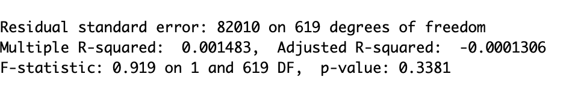

```{r setup, include=FALSE}
knitr::opts_chunk$set(echo = FALSE)

library(tidyverse)
library(readr)
library(Rcpp)
library(knitr)


data <- read.csv("racialdata.csv")


```


### Graph

```{r, echo=FALSE}
data$med_home_age <- 2021 - data$med_yrBuilt 
data$pop_density <- data$pop/data$area
data$city_pop <- sum(data$pop)
data$pop_pct <- data$pop/data$city_pop


data$majority_min <- ifelse((data$white/data$pop) < .5 , 1, 0)

options(scipen = 6) # no scientific notation in graphs
plot(med_house_val~jobs_idx, data = data, 
     ylab = "Median House Value (dollars)", 
     xlab = "Availiblity of Jobs", 
     main ="Median House Value and \n Availibility of Jobs \n by Neighborhood", col = "darkolivegreen")
abline(lm(med_house_val~jobs_idx, data))
```


### Results


Below are the statistical regression analysis results that we've concluded.


```{r}
  
```


This one as we can see shows that as each unit of jobs goes up, the value of the house increases by roughly $639


```{r}

```


We can see here the R squared value, which says how many of the data points can be explained by the best fit line. Additionally, the p-value is given and is above the alpha level.


### Conclusion


Based on the results and graphs that we made, we do not have statistically significant evidence to say that the availability of jobs and the median value of homes are correlated with one another.
