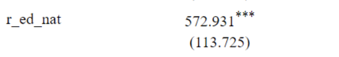
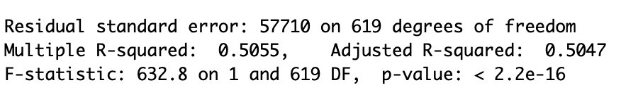

```{r setup, include=FALSE}
knitr::opts_chunk$set(echo = FALSE)


library(tidyverse)
library(readr)
library(Rcpp)
library(knitr)

data <- read.csv("racialdata.csv")


```


### Graph

```{r, echo=FALSE}
data$med_home_age <- 2021 - data$med_yrBuilt 
data$pop_density <- data$pop/data$area
data$city_pop <- sum(data$pop)
data$pop_pct <- data$pop/data$city_pop


data$majority_min <- ifelse((data$white/data$pop) < .5 , 1, 0)

options(scipen = 6) # no scientific notation in graphs
plot(med_house_val~r_ed_nat, data = data, 
     ylab = "Median House Value (dollars)", 
     xlab = "Local School Quality", 
     main ="Median House Value and \n Local School Quality \n by Neighborhood", col = "darkgoldenrod3")
abline(lm(med_house_val~r_ed_nat, data))
```


### Results


Below are the statistical regression analysis results that we've concluded.


```{r}

```

Looking at this, we can see that there is a positive relationship with education quality and the median house value of a home. As the education quality increases by one on the index, the average price increase of the home value is around $572.


```{r}

```


With these statistics, we are given the R squared value and the p-value. We can see that the R squared value is around 50% which signals that roughly 50% of the data can be explained by the best fit line. The p-value is extremely small and below our alpha value which tells us that this data isn't statistically significant. 

### Conclusion

With the data and stats provided, we can say that there is enough statistically significant evidence to say that the education quality and the median house value is correlated with each other and that a change the quality of education does create a change in the median house value.
