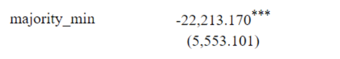
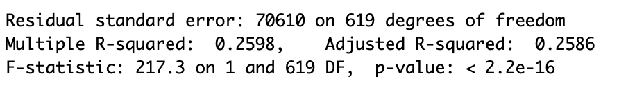

```{r setup, include=FALSE}
knitr::opts_chunk$set(echo = FALSE)

library(tidyverse)
library(readr)
library(Rcpp)

data <- read.csv("racialdata.csv")


```


### Graph

```{r, echo=FALSE}
data$med_home_age <- 2021 - data$med_yrBuilt 
data$pop_density <- data$pop/data$area
data$city_pop <- sum(data$pop)
data$pop_pct <- data$pop/data$city_pop


data$majority_min <- ifelse((data$white/data$pop) < .5 , 1, 0)


#### By Racial composition of neighborhood


```


```{r, include=FALSE}
mm = hist(data[data$majority_min == 1,]$med_house_val)

```


```{r, echo=FALSE}
mm$density = mm$counts/sum(mm$counts)*100
plot(mm,freq = FALSE, xlab = "Median House Value", ylab = "Percent",
     main="Median House Values ($) \n Majority Minority Neighborhoods", 
     xaxs="i", 
     yaxs="i",
     xlim = c(20000, 510000),
     ylim=c(0,60)
)
```


### Results

```{r}

```

Clearly, we can see that when the minority makes up most of the particular neighborhood, the median house value tends to decrease. On average, it decreases by $22,213. That alone kind of shows the great disparity between racial differences in the housing market.

```{r}

```

Roughly 26% of our data lines with a linear regression line according to the R-squared value. Additionally, our p-value is below our alpha level showing that there's a good amount of evidence to not have racial differences be a factor in this relationship.


### Conclusion

Based on the data we analyzed above, it is safe to say that the relationship between Majority Minority Neighborhoods and Median House value is greatly affected by racial differences and racial inequality in the housing market. 
