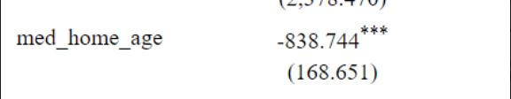
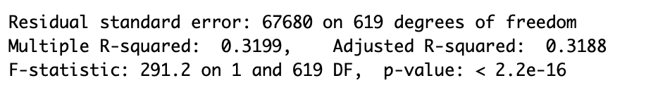

```{r setup, include=FALSE}
knitr::opts_chunk$set(echo = FALSE)

library(tidyverse)
library(readr)
library(Rcpp)

data <- read.csv("racialdata.csv")
```


### Graph

```{r, echo=FALSE}
data$med_home_age <- 2021 - data$med_yrBuilt 
data$pop_density <- data$pop/data$area
data$city_pop <- sum(data$pop)
data$pop_pct <- data$pop/data$city_pop


data$majority_min <- ifelse((data$white/data$pop) < .5 , 1, 0)


options(scipen = 6) # no scientific notation in graphs
plot(med_house_val~med_home_age, data = data, 
     ylab = "Median House Value (dollars)", 
     xlab = "Median Home Age", 
     main ="Median House Value and \n Median Home Age \n by Neighborhood")+
abline(lm(med_house_val~med_home_age, data))

```


### Results

```{r}

```

Looking at the median home age, there is a clear negative relationship with the median house value. This makes sense as older houses would typically have lower values due to factors like technology, number of owners, condition, etc. On average, each year a house gets older the value of the house decreases by $838.74.

```{r}

```

Glancing at the stats above, we can focus on the R-squared value and the p-value. Having the R-squared value being around 32%, 32% of our data can be explained by the regression analysis and the line it created. Our p-value is however really low, low enough to be below our alpha level which gives us evidence with our null and alternative statements.

### Conclusion

Based on the linear regression that was run between the two variables, we can see that with the p-value below our alpha level it signals that there is evidence to claim that there is a correlation between the House Age and the House Value.