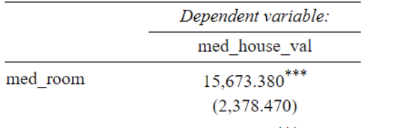
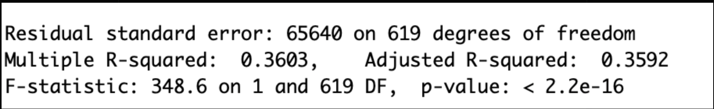

```{r setup, include=FALSE}
knitr::opts_chunk$set(echo = FALSE)

library(tidyverse)
library(readr)
library(Rcpp)
library(knitr)

data <- read.csv("racialdata.csv")


```


### Graph

```{r, echo=FALSE}
data$med_home_age <- 2021 - data$med_yrBuilt 
data$pop_density <- data$pop/data$area
data$city_pop <- sum(data$pop)
data$pop_pct <- data$pop/data$city_pop


data$majority_min <- ifelse((data$white/data$pop) < .5 , 1, 0)

options(scipen = 6) # no scientific notation in graphs
plot(med_house_val~med_room, data = data, 
     ylab = "Median House Value (dollars)", 
     xlab = "Median Number of Rooms", 
     main ="Median House Value and \n Median Number of Rooms \n by Neighborhood", col = "darkorange2")
abline(lm(med_house_val~med_room, data))

```


### Results


Below are the statistical regression analysis results that we've concluded.


```{r}

```

Here looking at the median number of rooms variable, it is clear that there is a positive relationship with the median house value. On average, each increase in rooms tends to increase the house value by $15,673.38.


```{r}

```

Again, we are given the R squared and p-value. R-squared being at .3603 shows that 36% of our data lines up with a linear regression line. Our p-value also being super small and below our alpha level shows that we have statistically significant evidence to establish a correlation.


### Conclusion

We are able to conclude that the median number of rooms in a house was significant in affecting the median house value as well as that there is an effect of race in these variables.