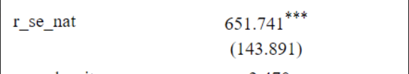
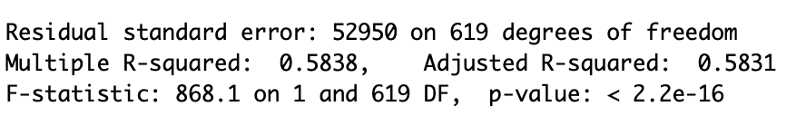

```{r setup, include=FALSE}
knitr::opts_chunk$set(echo = FALSE)

library(tidyverse)
library(readr)
library(Rcpp)

data <- read.csv("racialdata.csv")


```


### Graph

```{r, echo=FALSE}
data$med_home_age <- 2021 - data$med_yrBuilt 
data$pop_density <- data$pop/data$area
data$city_pop <- sum(data$pop)
data$pop_pct <- data$pop/data$city_pop


data$majority_min <- ifelse((data$white/data$pop) < .5 , 1, 0)

options(scipen = 6) # no scientific notation in graphs
plot(med_house_val~r_se_nat, data = data, 
     ylab = "Median House Value (dollars)", 
     xlab = "Socioeconomic Factors", 
     main ="Median House Value and \n Socioeconomic Factors \n by Neighborhood")
abline(lm(med_house_val~r_se_nat, data))
```


### Results

```{r}

```

Looking at socioeconomic factors, there is a positive relationship with the median house value. Having the house value increasing by around $651.74 every time there is an increase on socioeconomic factor index given from The Childhood Opportunity Index.

```{r}

```

The R-squared value is .5838 showing that over 50% of our data lines up with a best fit line calculated from a linear regression model. The P-value is really small and under our alpha level showing that there is good evidence to claim that our alternative hypothesis is true.


### Conclusion

We can conclude that the socioeconomic factors in relation to the median house value in a neighborhood is correlated with one another and that there any changes in one should change the other.