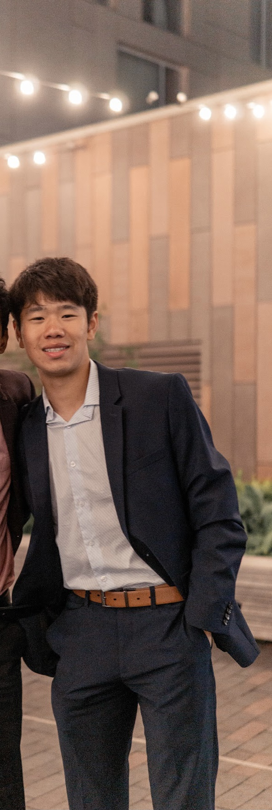

### Sources Used
https://www.kaggle.com/kunal28chaturvedi/covid19-and-its-impact-on-students
https://www.kff.org/coronavirus-covid-19/issue-brief/the-implications-of-covid-19-for-mental-health-and-substance-use/
https://www.kaggle.com/blurredmachine/are-your-employees-burning-out?select=train.csv


### About Me
My name is Bryan Li. I am currently a rising senior at Dublin Coffman High School. Some of my hobbies include playing tennis, playing violin, volunteering in my community, and helping grow myself as a person. This is my first time ever interacting with anytype of code and will be my first project done with code. I plan on adding more to this and make it more of a general page about mental health. If you wanna talk to me or ask any questions, feel free to reach out to me! I will add my handles below. Thank you for viewing my page!


Insta: _bryanli

Snap: bli735


```{r setup, include=FALSE}
knitr::opts_chunk$set(echo = FALSE)

library(tidyverse)
library(distill)
library(knitr)

```


```{r}
include_graphics("images/certificate.jpg")
```

```{r, echo=FALSE}

```

