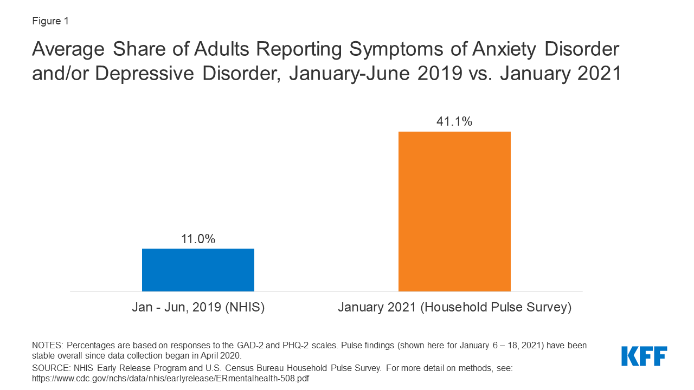
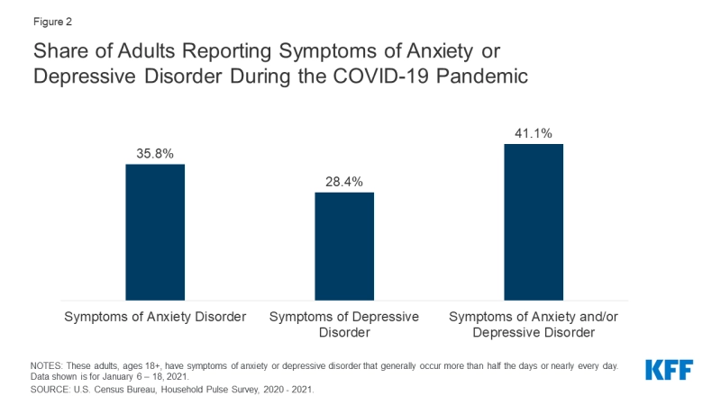

### 

```{r setup, include=FALSE}
knitr::opts_chunk$set(echo = TRUE)

library(tidyverse)
library(distill)
library(knitr)

```


```{r ,echo= FALSE}




```

```{r, echo=FALSE}




```


^[https://www.kff.org/coronavirus-covid-19/issue-brief/the-implications-of-covid-19-for-mental-health-and-substance-use/]
